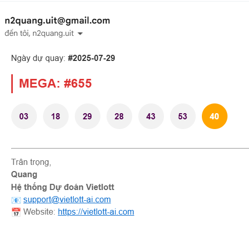
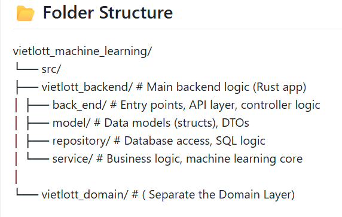

## 🧠 Vietlott Machine Learning (Preview)

Rust-based Machine Learning project to analyze & predict Vietlott lottery numbers.

---

### 🚀 Features in Full Version (v1.0.1)

- 📊 Analyze number frequency from historical draws
- 🌲 Integrate Decision Tree (via `linfa` crate)
- 🛢️ Connect and load data from SQL Server
- 📁 Domain/Service/Repository architecture
- 🔌 CLI or REST API support (configurable)

> ⚠️ This is a **preview version**. To access the full source code, see [HOW_TO_BUY.md](./HOW_TO_BUY.md).

---

### 📸 Output Example



---

### 🗂️ Folder Structure



---

### 💡 Demo Snippet

```rust
// src_demo/frequency_demo.rs
let frequency = calculate_number_frequency(vec![1, 2, 3, 4, 5, 6]);
println!("{:?}", frequency);
```

See more in [`src_demo/`](./src_demo/).

---

## 📩 Contact / Purchase

- See [HOW_TO_BUY.md](./HOW_TO_BUY.md) for full instructions
- Contact: n2quang.uit@gmail.com
